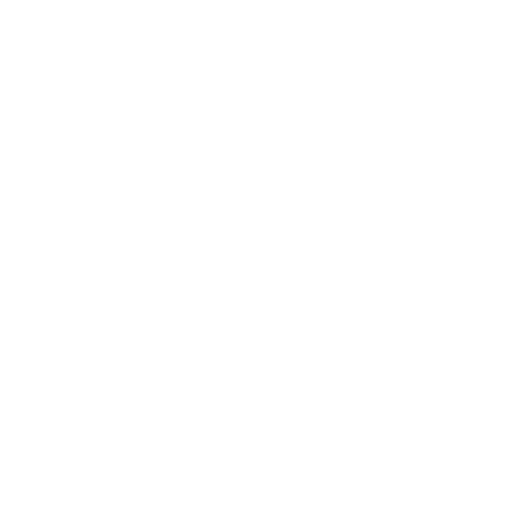

  
   
  

  

    
    <strong>I am open to internship opportunities in any interesting direction.</strong>
  

  

> Beyond the items listed above, I've also developed with Flutter, UE 5 and Godot. It may seem that I know a great many languages and tools.

> But actually, all I really master are Chinese, English and AI.
<h3 align="center"> 🛠 &nbsp;Languages & Tools I prefer</h3>

  

---

<table align="center" width="100%">
  <tr>
    <td width="40%" valign="middle" align="center">
      <h3 style="margin:0 0 10% 0;">I’m currently learning</h3>
      

        
        
        
        
      

    </td>
    <td width="60%" valign="middle" align="center">
      
    </td>
  </tr>
</table>

---

<h3 align="left">About Me</h3>

- Love open source. Open source makes the world great — let's make open source great again (MOSGA).
- Deep dive into AI & Agent frontiers.
- Three best buddies: Claude Code, Codex and Hermes.
- Chase beauty in everything, including this page.
- Hope to contribute to the open source community.

<picture>
  <source media="(prefers-color-scheme: dark)" srcset="https://raw.githubusercontent.com/Peter-JXL/Peter-JXL/output/github-contribution-grid-snake-dark.svg">
  <source media="(prefers-color-scheme: light)" srcset="https://raw.githubusercontent.com/Peter-JXL/Peter-JXL/output/github-contribution-grid-snake.svg">
  
</picture>

